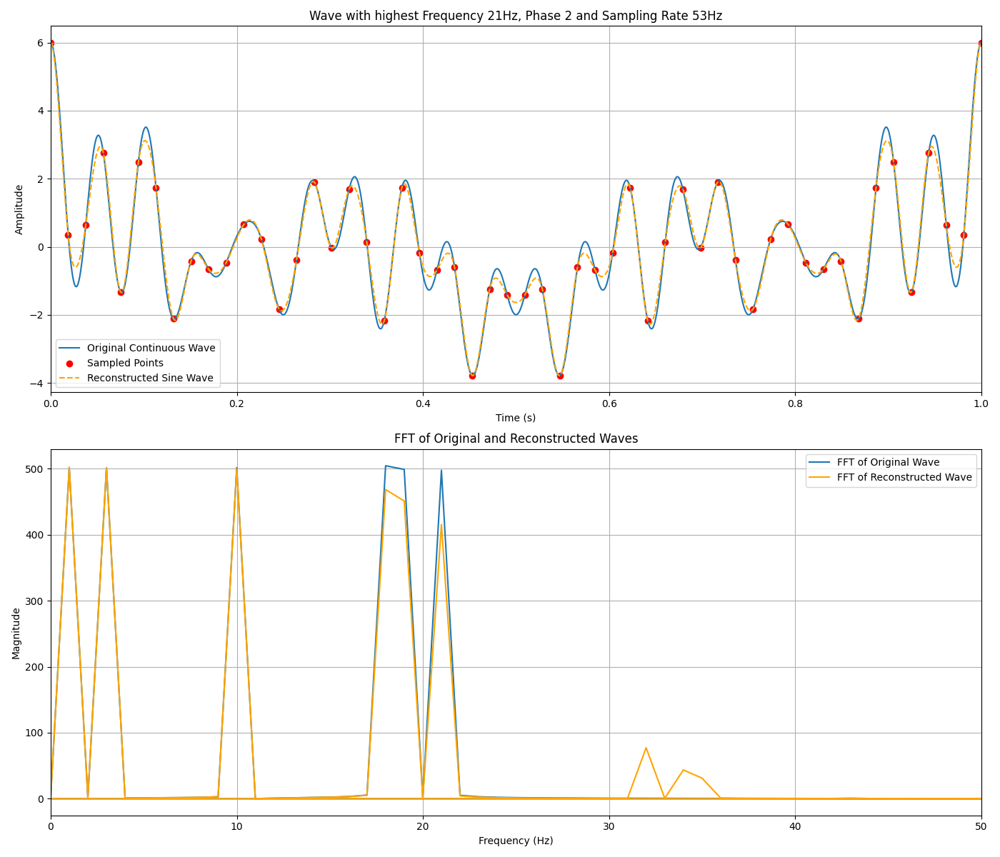
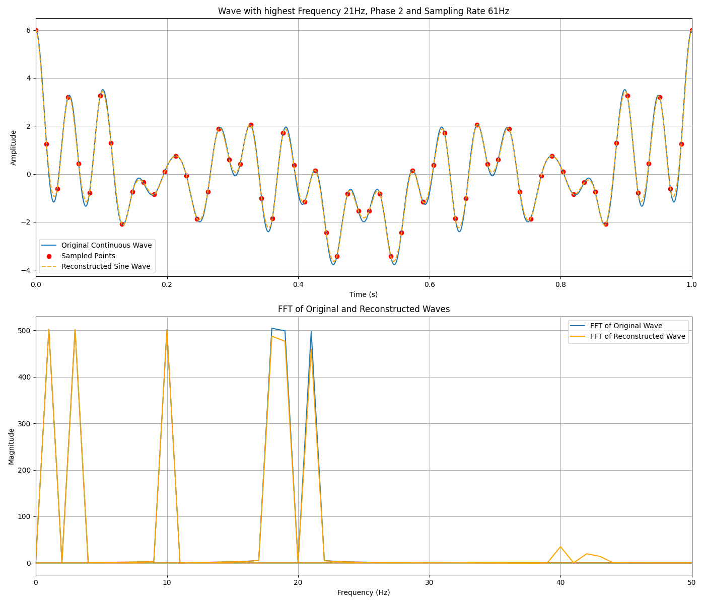
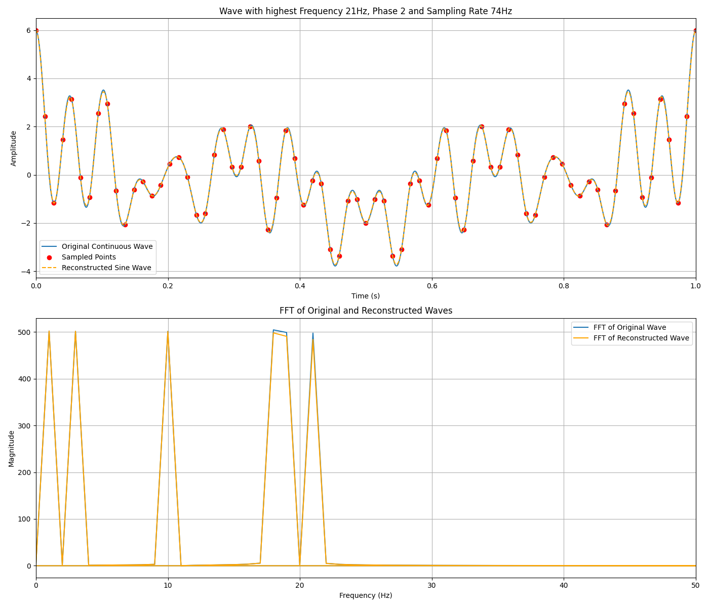

# SEL5720

Repositório para a disciplina de preparação pedagógica

## Aula sobre teorema da amostragem

### Para rodar o script (unix)

> O VS Code permite executar um *script shell* apenas clicando no arquivo `.sh` com o botão direito e selecionando a opção **Run Code**.

Criando o ambiente virtual e instalando as dependências.

```sh
sh scripts/init.sh
```

Executando o script.

```sh
sh scripts/run.sh
```

### Gráficos

Para todos os gráficos abaixo foi usada como sinal original uma senoide com frequência igual a 20Hz e um deslocamento de fase de *pi/2*.

---

#### Amostragem em 8Hz


---

#### Amostragem em 10Hz


---

#### Amostragem em 12Hz


---

#### Amostragem em 14Hz


---

#### Amostragem em 16Hz


---

#### Amostragem em 20Hz


---

#### Amostragem em 40Hz


---

#### Amostragem em 42Hz


---

#### Amostragem em 53Hz



---

#### Amostragem em 61Hz



---

#### Amostragem em 74Hz



---

#### Amostragem em 80Hz


---

#### Amostragem em 100Hz


---

#### Amostragem em 8Hz


---

#### Amostragem em 10Hz


---

#### Amostragem em 12Hz


---

#### Amostragem em 14Hz


---

#### Amostragem em 16Hz


---

#### Amostragem em 20Hz


---

#### Amostragem em 40Hz


---

#### Amostragem em 42Hz


---

#### Amostragem em 53Hz


---

#### Amostragem em 61Hz


---

#### Amostragem em 74Hz


---

#### Amostragem em 80Hz


---

#### Amostragem em 100Hz


---